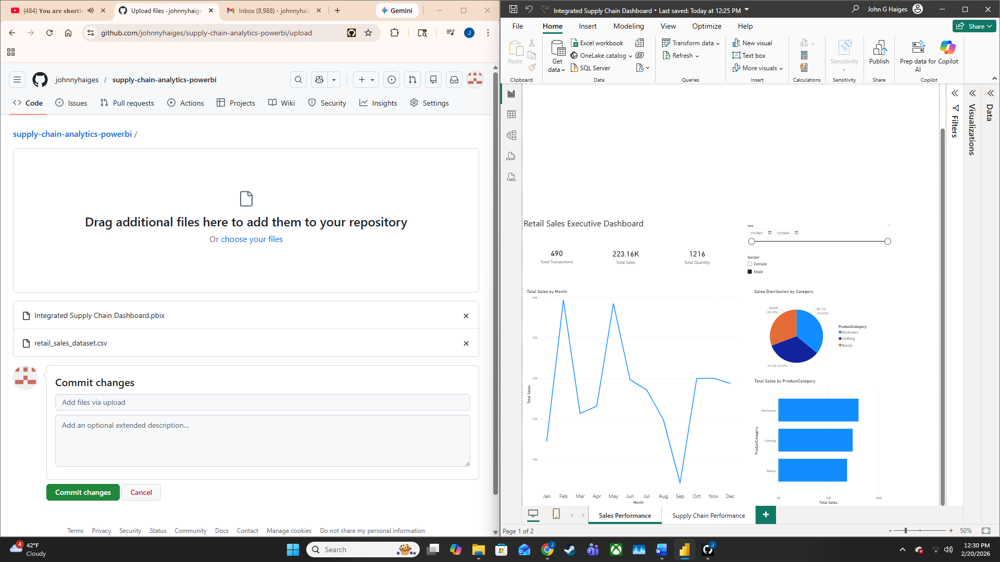
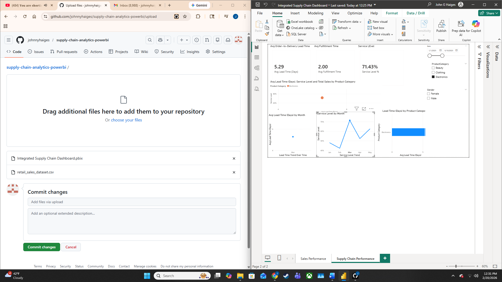
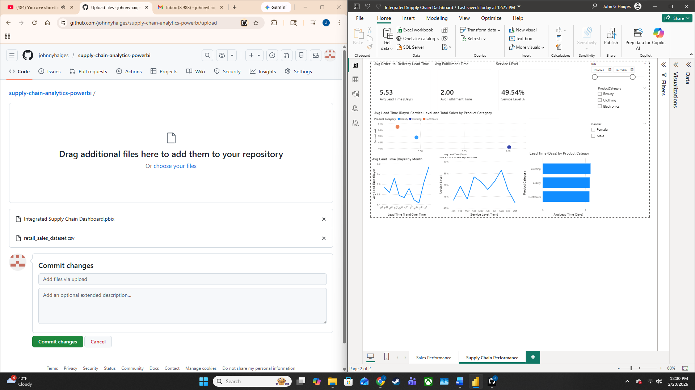
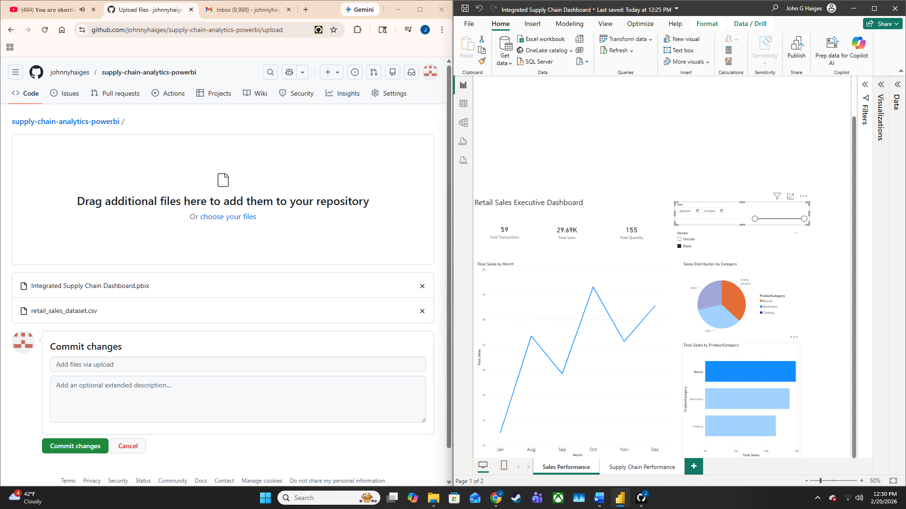

# Retail Supply Chain Analytics Dashboard


Two-page integrated Power BI report combining sales performance and supply chain KPIs on a single retail dataset. Built to demonstrate dashboard design, interactive filtering, and multi-page report architecture.


## How to Open


Download `Integrated Supply Chain Dashboard.pbix` and open in Power BI Desktop (free download from Microsoft). The CSV in `data/` is included for re-running the model from scratch if desired.


## What's Inside


**Page 1 — Sales Performance**

Executive sales view with monthly trend, category mix, and headline KPIs (total transactions, total sales, total quantity). Interactive filters for date range and customer gender drive recalculation across all visuals.


**Page 2 — Supply Chain Performance**

Operational view centered on three KPIs: average order-to-delivery lead time, average fulfillment time, and service level percentage. Includes trend lines for lead time and service level over time, lead time by product category, and a scatter integrating lead time, service level, and sales by category.


The two pages share the same data model and slicers, so filtering on one dimension (e.g., Electronics-only) recalculates both sales and supply chain views simultaneously — demonstrating cross-page model integration rather than two disconnected reports.


## Demonstrated Capabilities


- **Multi-page report design** with shared data model

- **KPI card construction** with summary measures

- **Interactive slicers** (date range, product category, gender) driving cross-visual filtering

- **Mixed visualization types:** line charts, donut charts, horizontal bar charts, scatter plots, KPI cards

- **Power Query** for source data preparation

- **DAX measures** for KPIs and aggregations


## Dashboard Views


### Sales Performance (Page 1)





### Supply Chain Performance (Page 2)





### Interactive Filtering Example


Filtering to Electronics-only on the Supply Chain page recalculates KPIs: service level rises from ~50% (all categories) to ~71% (Electronics alone), illustrating live cross-visual interactivity.





### Date-Filtered Sales View





## Dataset


Retail sales transaction dataset sourced from Kaggle. Includes transaction-level records with date, customer demographics (gender, age), product category (Beauty, Clothing, Electronics), quantity, and sales amount.


## Stack


Power BI Desktop (.pbix), Power Query, DAX.


## Repository

```

data/                            retail_sales_dataset.csv

images/                          dashboard screenshots

Integrated Supply Chain Dashboard.pbix

README.md

```

